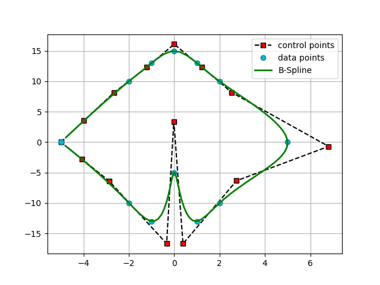
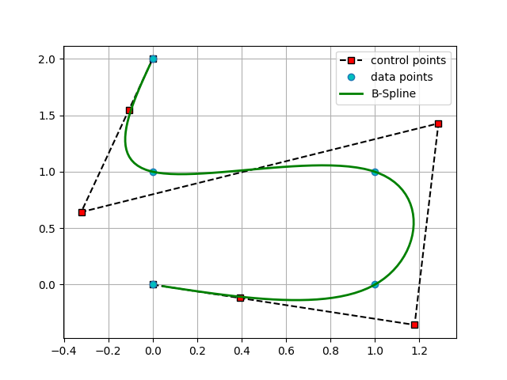

# Cubic-B-Spline-Interpolation

This repo implements cubic B-spline interpolation with Python from scratch. If you are not familiar with B-Spline, you can click [here](https://web.mit.edu/hyperbook/Patrikalakis-Maekawa-Cho/node17.html) to quickly grasp the knowledge.

### Requirements
The only two requrired packages are Numpy for matrix operation and matplotlib for curve visualization.

* [Numpy 1.18.2](https://numpy.org/devdocs/release/1.18.0-notes.html)
* [Matplotlib 3.2.1](https://matplotlib.org)

# Implementation
The input file is in the ```/data``` directory, which contains a set of 2D points like:

```
x0 y0
x1 y1
...
xn yn
```

To interpolate these data points with B-Spline curve, run the following command in the terminal:

```
git clone https://github.com/RuihangWang/Cubic-B-Spline-Interpolation
cd Cubic-B-Spline-Interpolation
python main.py
```

You can also test your own data points by modifying the ```config.py``` with corresponding .txt input file. Then, the program will output a cubic B-spline curve to ```/results``` in the following format:

```
3
cnt_num
u0 u1 u2
x0 y0
x1 y1
...
```

where “3” represents the degree of the B-spline curve, “cnt_num” is the number of the control points, “u0, u1, …” are the knot sequence of the curve, “x0 y0” are the x- and y-coordinates of the first control point, “x1 y1” are the x- and y-coordinates of the second control point, and so on.

# Visualization
To plot the interpolating curve, choose the output filename in ```config.py``` and run 
the following command in the terminal:
```angular2
python plot.py 
```
The interpolating curves of the two example data points
are shown as follow.


